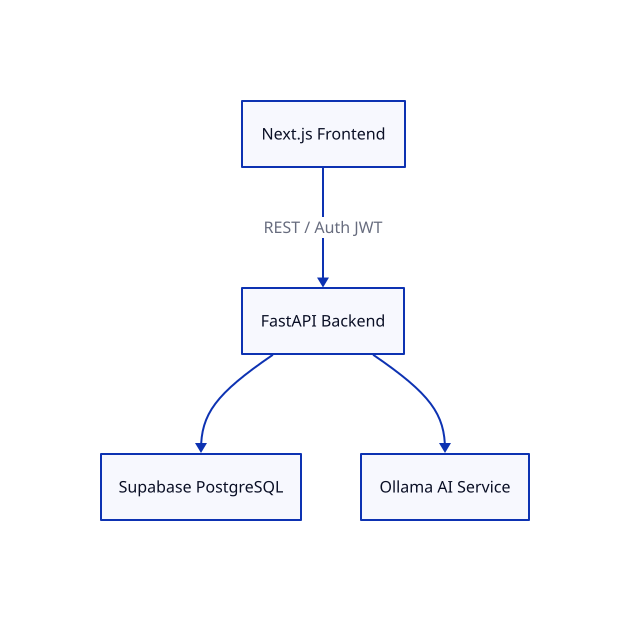

# Architecture

This document records major architectural decisions for the project. Each layer of the system is captured as an independent Architecture Decision Record (ADR) within this file.

## System Goals
- Socratic, AI-assisted learning without providing direct solutions.
- Dynamic topic roadmaps that adapt to user struggle.
- Scalable web platform for assessments and progress tracking.
- Low operational cost with strong privacy controls.
- Clear separation between UI, logic, data, and AI inference.

## High-Level Structure
- Frontend: Next.js
- Backend: FastAPI
- Data & Auth: Supabase (PostgreSQL)
- Code Execution: Judge0 (self-hosted for development)
- AI Runtime: Gemini (cloud-only)

## Architecture Overview

---

## ADR-0001 – Frontend Framework: Next.js

### Status
Accepted – 2026-02-06

### Context
The platform requires an interactive web interface for:
- Assessments with short and normal options.
- Topic roadmap navigation and branching.
- Problem attempts, runs, and submissions.
- Real-time AI tutoring interactions.

### Decision
Use **Next.js** as the primary frontend framework.

### Rationale
- File-based routing and React ecosystem.
- Server Components for performance.
- Built-in API routes for BFF patterns.
- Strong community and UI library support.
- Simple deployment (Vercel or self-hosted).

### Consequences
- Faster UI development.
- Need to manage CORS with FastAPI.
- Requires Node environment for builds.

---

## ADR-0002 – Backend Service: FastAPI

### Status
Accepted – 2026-02-06

### Context
The backend must:
- Deliver assessments and score results.
- Calculate hidden skill levels.
- Orchestrate topic roadmaps and branching.
- Integrate with code execution and AI services.

### Decision
Use **FastAPI (Python)** as the backend service.

### Rationale
- Async performance for AI calls.
- Automatic OpenAPI documentation.
- Strong typing with Pydantic.
- Native Python ecosystem for ML.
- Simple, explicit architecture.

### Consequences
- Clear boundary between UI and logic.
- Easy integration with code execution services.
- Requires API gateway or reverse proxy.

---

## ADR-0003 – Data & Authentication: Supabase

### Status
Accepted – 2026-02-06

### Context
We require storage for:
- User accounts.
- Assessment results and skill snapshots.
- Topic roadmaps, branching state, and progress history.

### Decision
Use **Supabase** for PostgreSQL database and authentication.

### Rationale
- Managed PostgreSQL with RLS.
- Built-in auth and JWT.
- Real-time capabilities.
- Minimal DevOps overhead.

### Consequences
- Fast startup with secure auth.
- Vendor dependency.
- Need migrations strategy.

---

## ADR-0004 – AI Runtime: Gemini (Cloud-Only)

### Status
Accepted – 2026-03-26

### Context
The AI must:
- Provide Socratic hints.
- Analyze skill gaps.
- Never return full solutions.
- Operate with low latency.

### Decision
Use **Gemini** as a cloud-only AI runtime.

### Rationale
- High-quality reasoning.
- Managed scaling and reliability.
- Faster iteration during MVP.

### Consequences
- Usage-based cost model.
- External dependency for AI availability.

---

## ADR-0005 – Code Execution: Judge0 (Dev)

### Status
Accepted – 2026-03-26

### Context
The platform must run untrusted code submissions safely and at scale, with consistent language support.

### Decision
Use **Judge0 self-hosted** for development environments.

### Rationale
- Sandboxed execution.
- Scalable architecture.
- Widely used in coding platforms.

### Consequences
- Requires containerized deployment.
- Production hosting strategy remains open.

---

## Cross-Layer Considerations

### Integration Flow
1. User interacts with Next.js UI.
2. FastAPI handles business logic and assessment scoring.
3. Supabase stores users, skill levels, and roadmap state.
4. Judge0 executes code runs and submissions.
5. Gemini provides guided responses.

### Risks
- Model cost volatility.
- Multi-service complexity.
- Code execution isolation failures.

### Mitigations
- Output validation layer.
- Interaction logging.
- Execution sandboxing and rate limits.

---

## Author
CXKing23
